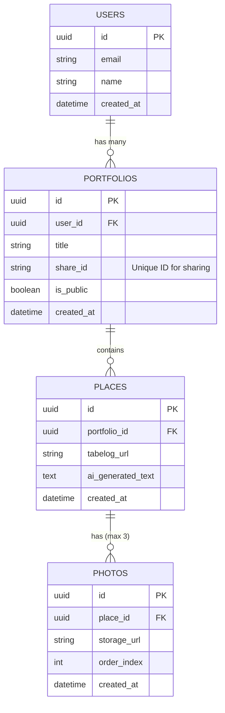

# データベース設計書

## 1. データベース概要

本システムでは、バックエンド・データベースとして **Supabase (PostgreSQL)** を採用します。RDBによるリレーショナルなデータ管理と、Row Level Security (RLS) を用いたセキュアなデータアクセス制御を実現します。また、画像などのメディアファイルはSupabase Storageに保存し、そのURLをデータベースで管理します。

## 2. ER図

以下は、本システムの主要なエンティティとその関係性を示すER図です。

## 3. テーブル定義

### 3.1 USERS テーブル
認証プロバイダー（Clerk）側で管理されるユーザー情報とアプリケーション内のデータを紐付けるためのプロファイルテーブルです。

| カラム名 | データ型 | 制約 | 説明 |
| :--- | :--- | :--- | :--- |
| `id` | `uuid` | Primary Key | ClerkのUser ID（またはSupabase Authと連携したUUID） |
| `email` | `varchar(255)` | Unique, Not Null | ユーザーのメールアドレス |
| `name` | `varchar(255)` | | ユーザーの表示名（オプション） |
| `created_at` | `timestamp with time zone` | Default: `now()` | レコード作成日時 |

### 3.2 PORTFOLIOS テーブル
ユーザーが作成するお店のリスト（グループ）を管理します。この単位で外部共有用のURLが発行されます。

| カラム名 | データ型 | 制約 | 説明 |
| :--- | :--- | :--- | :--- |
| `id` | `uuid` | Primary Key | ポートフォリオの一意なID |
| `user_id` | `uuid` | Foreign Key (`users.id`), Not Null | 作成したユーザーのID |
| `title` | `varchar(255)` | Not Null | リストのタイトル（例: 「横浜の中華」） |
| `share_id` | `varchar(64)` | Unique, Not Null | 共有URLに利用する推測不可能なランダム文字列 |
| `is_public` | `boolean` | Default: `true` | `true`の場合、`share_id`を知る未ログインユーザーも閲覧可能 |
| `created_at` | `timestamp with time zone` | Default: `now()` | レコード作成日時 |

### 3.3 PLACES テーブル
ポートフォリオに追加される個々の店舗情報（食べログURL）と、AIによって生成された紹介記事を保存します。

| カラム名 | データ型 | 制約 | 説明 |
| :--- | :--- | :--- | :--- |
| `id` | `uuid` | Primary Key | お店登録情報の一意なID |
| `portfolio_id` | `uuid` | Foreign Key (`portfolios.id`), Not Null | 所属するポートフォリオのID |
| `tabelog_url` | `varchar(1024)` | Not Null | ユーザーが入力した食べログのURL |
| `ai_generated_text` | `text` | | AIによって生成・整形された紹介記事のテキスト |
| `created_at` | `timestamp with time zone` | Default: `now()` | レコード作成日時 |

### 3.4 PHOTOS テーブル
`PLACES` に紐づく写真のメタデータとStorageへのURLを管理します。アプリケーションロジックにて、1つの `place_id` につき最大3レコードとなるよう制限します。

| カラム名 | データ型 | 制約 | 説明 |
| :--- | :--- | :--- | :--- |
| `id` | `uuid` | Primary Key | 写真データの一意なID |
| `place_id` | `uuid` | Foreign Key (`places.id`), Not Null | 紐づくお店情報（PLACES）のID |
| `storage_url` | `varchar(1024)` | Not Null | Supabase Storage上の公開URLまたはパス |
| `order_index` | `integer` | Default: 0 | 写真の表示順序（0, 1, 2） |
| `created_at` | `timestamp with time zone` | Default: `now()` | レコード作成日時 |

## 4. セキュリティとRow Level Security (RLS) 方針

SupabaseのRLS機能を用いて、以下のアクセス制御ルールを設定します。

1. **自身のデータへのフルアクセス**:
   - `PORTFOLIOS`, `PLACES`, `PHOTOS` テーブルにおいて、`user_id` が自身の認証IDと一致するレコードに対しては、`SELECT`, `INSERT`, `UPDATE`, `DELETE` 全てを許可する。
2. **パブリック閲覧の許可**:
   - `PORTFOLIOS` テーブルの `is_public` が `true` のレコードは、未認証ユーザーであっても `SELECT` のみ許可する。
   - 上記の公開ポートフォリオに紐づく `PLACES` および `PHOTOS` レコードについても同様に `SELECT` を許可し、共有URLからの閲覧を可能にする。