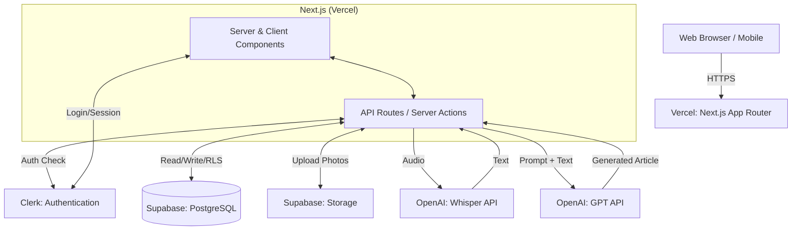

# システムアーキテクチャ設計書

## 1. システム構成と技術スタック

本システムは、MVP（Minimum Viable Product）としての高速な検証と、将来的なバイラルループによるトラフィック増に耐えうるスケーラビリティを両立するため、以下のモダンな技術スタックを採用します。

### 1.1 技術スタックと選定理由

- **フロントエンド・バックエンド**: Next.js (App Router), React, TypeScript, Tailwind CSS
  - 選定理由: Server ComponentsとClient Componentsの使い分けにより、初期ロードの高速化（SEO・OGP対応に必須）とインタラクティブなUIを両立できる。同一リポジトリでAPI（Server Actions / Route Handlers）を管理でき、個人開発のMVPフェーズにおいて圧倒的な開発効率を誇るため。
- **データベース & ストレージ**: Supabase (PostgreSQL)
  - 選定理由: RDBの堅牢なデータモデリングに加え、写真や音声データの保存に必要なStorage機能、およびRow Level Security (RLS) によるセキュアなデータアクセス制御がBaaSとして統合されており、バックエンドの構築コストを大幅に削減できるため。
- **認証**: Clerk
  - 選定理由: Next.js App Routerとの親和性が極めて高く、GoogleやLINE等のソーシャルログインを含む認証基盤を数時間でセキュアに構築可能であるため。
- **AI・音声認識**: OpenAI API (Whisper API, GPT-4o mini)
  - 選定理由: Whisperによる高精度な音声テキスト化と、GPTモデルによる高度なプロンプトエンジニアリング（トーン＆マナーの制御）を組み合わせることで、本アプリのコアバリューである「雑多な独り言からのエモーショナルな記事生成」を実現できるため。
- **ホスティング**: Vercel
  - 選定理由: Next.jsの開発元であり、ゼロコンフィグでデプロイ可能。エッジネットワークによるグローバルなキャッシュ配信により、共有URL経由でのバーストトラフィック（突発的なアクセス増）にも自動で対応できるため。

## 2. アーキテクチャ概要

以下は、本システムの全体的なアーキテクチャを示す構成図です。



### コンポーネントの役割

1. **Client (Web Browser / Mobile)**: ユーザーが操作するインターフェース。モバイルファーストで設計されたレスポンシブなWebUI。
2. **Next.js (Vercel)**:
   - **Server Components**: DBからのデータフェッチ（ポートフォリオ一覧や公開URLのデータ取得）を担当し、初期HTMLを生成してクライアントに返す。
   - **Client Components**: 音声録音UIや写真のアップロード処理など、ブラウザAPIに依存するインタラクティブな機能を提供する。
   - **Server Actions / API Routes**: AI記事生成処理など、セキュアなサーバー環境で実行すべきビジネスロジックをホストする。
3. **Clerk**: ユーザー認証とセッション管理を担う。ミドルウェアで保護されたルートへのアクセス制御を行う。
4. **Supabase**: アプリケーションの永続データを保存するPostgreSQLデータベースと、アップロードされたメディアファイル（画像・一時的な音声）を保存するStorageを提供する。
5. **OpenAI API**: 録音された音声データのテキスト化（Whisper）と、そのテキストを基にした紹介記事の生成（GPT）という、アプリのコア機能を提供する。

## 3. コンポーネント設計方針

Next.js App Routerの思想に基づき、Server ComponentsとClient Componentsを明確に分離して設計します。

### 3.1 コンポーネント階層図

```mermaid
graph TD
    Root[app/layout.tsx - Server] --> LP[app/page.tsx - Server: LP]
    Root --> Dashboard[app/dashboard/layout.tsx - Server: Auth Required]
    
    Dashboard --> PortfolioList[app/dashboard/page.tsx - Server]
    Dashboard --> PortfolioDetail[app/dashboard/p/[id]/page.tsx - Server]
    
    PortfolioDetail --> AddPlacePage[app/dashboard/p/[id]/add/page.tsx - Server]
    AddPlacePage --> AddPlaceForm[AddPlaceForm.tsx - Client]
    
    AddPlaceForm --> AudioRecorder[AudioRecorder.tsx - Client]
    AddPlaceForm --> PhotoUploader[PhotoUploader.tsx - Client]
    
    Root --> ShareView[app/share/[shareId]/page.tsx - Server: Public]
    ShareView --> PlaceCard[PlaceCard.tsx - Client/Server]
```

### 3.2 状態管理とデータフローの方針

- **Server Components (デフォルト)**:
  - `app/dashboard/page.tsx` や `app/share/[shareId]/page.tsx` など、データの表示が主目的のページはServer Componentsとする。
  - Supabaseクライアントを用いてサーバーサイドでデータを直接フェッチし、PropsとしてClient Components（またはネストされたServer Components）に渡す。
- **Client Components (`"use client"`)**:
  - `AddPlaceForm`、`AudioRecorder` など、ユーザーの入力やブラウザAPI（MediaRecorder等）を扱うコンポーネントのみClient Componentsとして宣言する。
  - **状態管理**: グローバルな状態管理ライブラリ（ReduxやZustand等）はMVPフェーズでは導入せず、React標準の `useState`, `useReducer`, フォーム管理のための `react-hook-form` 等を用いて局所的に状態を管理する。
  - **サーバーとの通信**: データ送信や複雑な処理（AI生成など）は、Next.jsの **Server Actions** を呼び出すことで、API Routeを明示的に作成する手間を省き、型安全なRPC（Remote Procedure Call）を実現する。

### 3.3 主要コンポーネント定義例

- `AddPlaceForm` (Client Component)
  - 役割: お店データ追加のための統合フォーム。
  - 状態: フォームの入力値、録音状態、アップロード中の画像、AI生成のローディング状態など。
- `PlaceCard` (Client Component 寄りの設計を推奨)
  - 役割: 閲覧画面で個々のお店の情報を表示するカード。写真のスワイプ（カルーセル）機能を持つためClient化が必要。
  - Props: `place` オブジェクト（店舗URL、AI生成テキスト、写真URLの配列を含む）。
