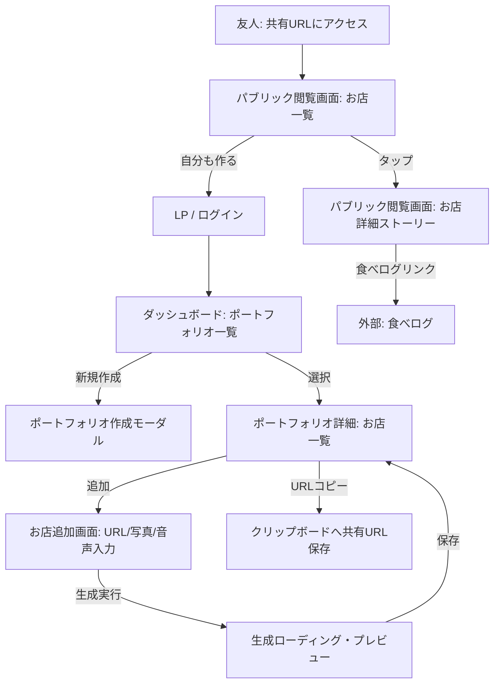

# UI/UX設計書

## 1. デザインコンセプト

本アプリケーションのコアバリューは、「入力の手間を省くこと」と「圧倒的に洗練されたリッチな読後感を共有すること」です。そのため、UI/UXは機能性を重視しつつも、出力されるコンテンツの美しさを最大化するデザインを目指します。

### 1.1 テーマ：いけてる感じ（洗練されたクリエイティビティ）
- **ベンチマーク**: TakramのWebサイト（https://www.takram.com/ja）
- **トーン＆マナー**: ミニマル、洗練されたモダンさ、プロフェッショナル。上質で落ち着きがあり、かつ新しい価値（イノベーション）を感じさせるデザイン。
- **情報の引き算**: 食べログのような事務的なデータベース感（星の数、細かいスペック情報等の羅列）を徹底的に排除し、写真やタイポグラフィ（AIが生成したストーリー）が主役として際立つように余白（ホワイトスペース）を大胆に活かします。

### 1.2 デザインシステム基礎
- **カラーパレット**:
  - **背景 (Base)**: オフホワイト (`#FAFAFA`) - 写真を最も美しく見せるためのクリーンなキャンバス。
  - **テキスト (Text Main)**: ソフトブラック/ダークグレー (`#1A1A1A` または `#333333`) - 真っ黒を避け、上品な読みやすさを確保。
  - **サブテキスト (Text Sub)**: ミディアムグレー (`#777777`) - 補足情報用。
  - **アクセント/アクション (Accent)**: 落ち着いたトーンのカラー（例：ミュートされた黒や、セージグリーンなど、主張しすぎない色）ボタンやインタラクションのフィードバックに使用。
- **タイポグラフィ**:
  - **本文・UI要素**: 洗練されたモダンなゴシック体（例：Inter, Noto Sans JP）。
  - **生成されたストーリー（強調）**: 雑誌のエッセイのような読み心地を演出するため、明朝体（例：Noto Serif JP）をアクセントとして見出しや引用部分に取り入れることを検討。
- **コンポーネント**: 余分な枠線や強いドロップシャドウを避け、フラットでクリーンなカードUIや、空間の区切り（マージン）を利用して要素を構成する。

## 2. 画面一覧と画面遷移

### 2.1 画面一覧
1. **LP（ランディングページ） / ログイン画面**: サービスの魅力と登録への導線。
2. **ポートフォリオ一覧（ダッシュボード）**: ユーザーが作成したリストの管理。
3. **ポートフォリオ詳細**: 特定のリスト内にあるお店の管理と、共有URLの発行。
4. **お店追加画面**: アプリのコアとなる入力体験。URL・写真・音声の入力フォーム。
5. **生成プレビュー画面**: AI生成結果の確認。
6. **パブリック閲覧画面（一覧・詳細）**: 共有されたURLからアクセスされる、未登録者向けの見せるための画面。

### 2.2 画面遷移図 (Mermaid)

## 3. 主要画面ワイヤーフレーム仕様

### 3.1 お店追加画面 (入力体験)
**目的**: 「長文を打つのが面倒」というペインを解消し、「ただ喋るだけでいい」という手軽さを直感的に伝える。

- **レイアウト構成**:
  - **ヘッダー**: バックボタンと「新しいお店を記録」という控えめなタイトル。
  - **URL入力エリア**: 「食べログのURL」をペーストするためのシンプルな1行のテキストフィールド。
  - **写真アップロードエリア**: 点線枠で囲まれた領域。タップでカメラロールを開く。「厳選した写真を最大3枚まで」というガイドテキストを添える。
  - **音声入力エリア（コア要素）**: 
    - 画面下部中央に、大きく目立つ**円形のマイクボタン**を配置。
    - 「ここが良かった！を独り言でどうぞ」といった、心理的ハードルを下げるマイクロコピーを配置。
    - 録音中はボタンが波打つアニメーションなどでフィードバックを示す。
  - **アクションエリア**: マイク録音が完了し、必須項目が揃うとアクティブになる「AIで記事を生成する」ボタン（ソリッドな黒色など）。

### 3.2 パブリック閲覧画面・詳細 (読後感・共有体験)
**目的**: 友人から送られてきたURLを開いた瞬間、「おしゃれで美味しそう」と感じさせ、ストーリーを読ませて感動させる。

- **レイアウト構成 (モバイルファースト)**:
  - **ヒーローエリア (上部)**:
    - 画面上部の約60%を占める、アップロードされた写真のカルーセル（スワイプで切り替え、最大3枚）。
    - 画像には薄いグラデーションオーバーレイをかけ、画面上部のシステムステータス等の視認性を確保。
  - **コンテンツエリア (下部)**:
    - 写真エリアに少し重なるような形で、上角が丸い白いカード状のコンテンツエリアが配置される。
    - 余白をたっぷりと取り、AIが生成した**「洗練された紹介テキスト」**を、エッセイのように美しいフォント（明朝体など）でゆったりと配置する。余計な装飾は一切入れない。
    - その下に、細く控えめなディバイダー線。
  - **リンクエリア**:
    - 「食べログで詳細を見る」というクリーンなアウトラインボタン。
  - **CTA (Call To Action) エリア**:
    - 画面最下部に固定（フローティング）で、「自分もこのアプリでお店リストを作ってみる（無料）」というバナー状のボタンを配置し、バイラルループへの導線とする。