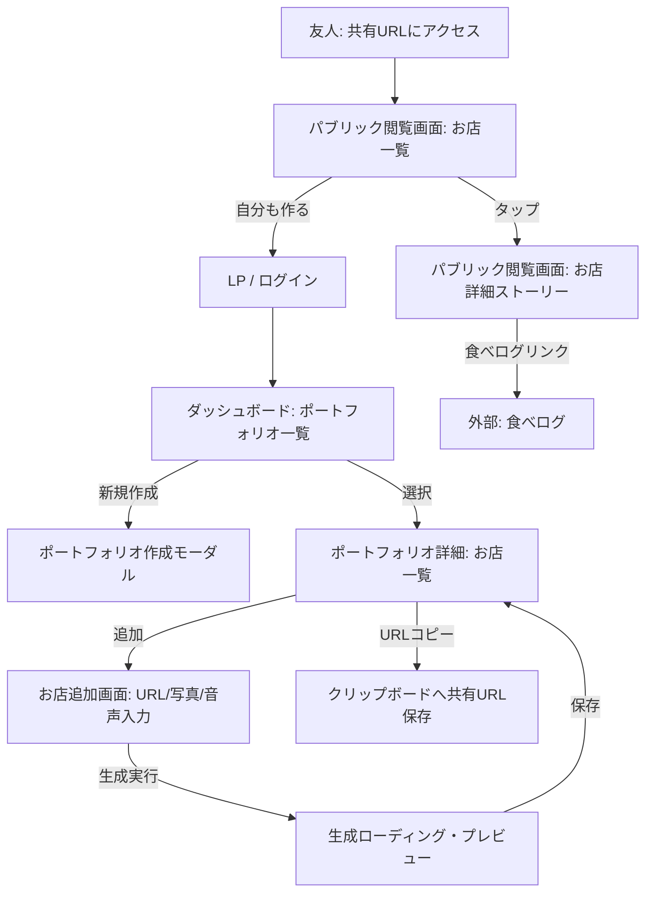
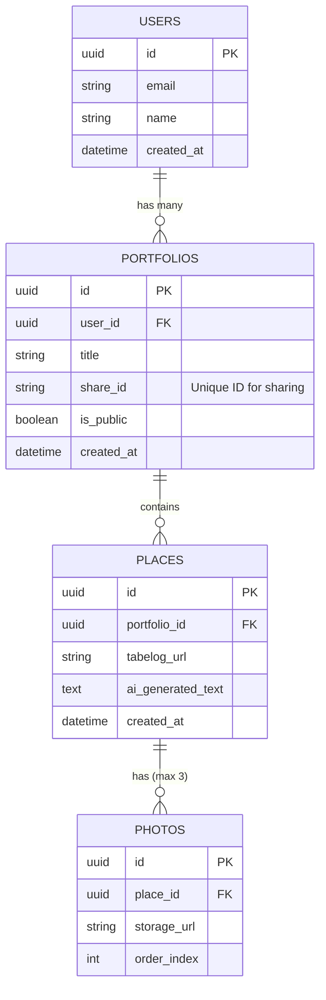
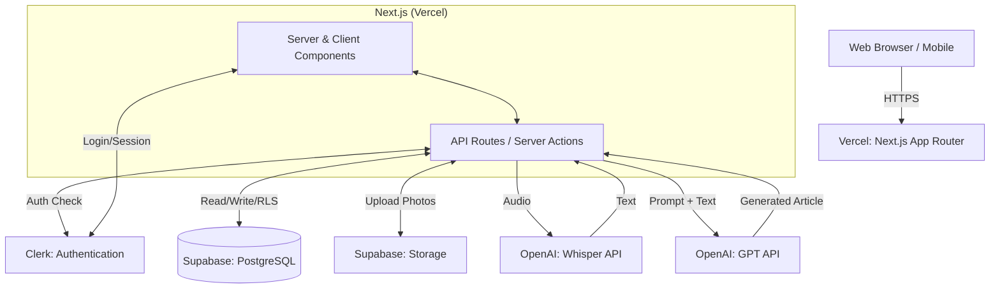

# 要件定義書

## 1. プロジェクト概要

### 1.1 プロジェクト名

- **「飲食店ポートフォリオアプリ（仮）」開発プロジェクト**

### 1.2 背景・目的

- **背景**: 日常的なコミュニケーションにおいて、「おすすめの飲食店を教える」際、食べログのURLを送るだけでは体験の熱量やコンテキストが伝わらず、かといってLINEで長文を打ち込み写真を探すのは非常に手間がかかるというジレンマが存在している。
- **目的**: 音声入力とAIを活用することで「入力の手間」と「伝わる熱量」のギャップを解消し、教える側が手軽にリッチな紹介記事を生成・共有できる体験を提供する。定量的には、初期検証（MVP）において、ユーザーが自発的にURLを共有し、受信者が新規登録に至るバイラルループの基盤を構築する。

### 1.3 システムのビジョン / スコープ

- **ビジョン**: 個人の実体験と熱量に基づいた、スコアに依存しない新しい飲食店情報の流通プラットフォームとなること。
- **スコープ**: 今回はMVPとして、Webアプリ（モバイル最適化）を用いた「音声・写真・食べログURL入力からのAI記事自動生成」「ポートフォリオ（リスト）管理」「URL共有機能」を対象とする。複数人共同編集や、URLからの高度なスクレイピング機能はスコープ外とする。

---

## 2. ビジネス要件

### 2.1 ビジネスモデル情報

- **リーンキャンバスのまとめ**:
  - **課題**: 飲食店を紹介する際の長文入力の手間と、URLだけでは熱量が伝わらない問題。
  - **解決策**: 音声（独り言）と写真をAIがエモーショナルな記事に自動整形する機能。
  - **独自の価値提案**: 圧倒的な入力の手軽さと、出力される記事（ポートフォリオ）のリッチさ。
  - **収益構造**: 初期は完全無料。将来的にプレミアム課金や店舗側スポンサー、広告モデルを想定。
- **市場規模 / 成長予測**: (仮定) 初期のターゲット層は都市部のインフルエンサー気質の食通ユーザー（数百名規模）。彼らを起点に口コミでユーザー獲得を見込む。

### 2.2 成果指標（KPI/KGI）

- **KPI (仮定)**:
  - MVPリリース後1ヶ月でのポートフォリオ記事生成数：100件
  - 発行されたURLの共有（アクセス）回数：500回
  - 共有URL受信者からの新規登録率（バイラル係数）：5%以上

### 2.3 ビジネス上の制約

- **予算・期間**: 個人プロジェクト・MVPのため、開発期間は1〜2週間。インフラ費用・APIコストは最小限（無料枠および安価な従量課金）に抑える。
- **法的要件**: 著作権への配慮として、他者の写真無断使用を防ぐため利用規約で自己撮影写真の使用を求め、店舗情報は食べログURLのリンク併記で出処を明確にする。

---

## 3. ユーザー要件

### 3.1 ユーザープロファイル / ペルソナ

1. **教える側（メインペルソナ）**: 食通のインフルエンサー・口コミハブ
   - 都市部在住の会社員・フリーランス。頻繁に外食し、友人からよく「美味しいお店」を聞かれる。
   - **課題**: 自分の体験や熱量を伝えたいが、長文を打つのが面倒。
2. **受け取る側（サブペルソナ）**: お店を探している友人
   - デートや会食で「ハズさないお店」を知りたい。
   - **課題**: 食べログの点数だけでは自分に合うか分からず、信頼できる友人の「生の声」と「ストーリー」が欲しい。

### 3.2 ユーザーストーリー

- 教える側として、お店のURLと写真を選び、適当な独り言を録音するだけで、美しい紹介記事を作りたい。なぜなら、スマホで長文をタイピングするのは非常に面倒だからだ。
- 教える側として、作成した「横浜の中華」などのリストをURL一つで友人に共有したい。なぜなら、LINEで聞かれた時にサクッとスマートに教えたいからだ。
- 受け取る側として、友人から送られたURLを開いた瞬間、雑誌のような美しい写真と熱量あるストーリーを読みたい。なぜなら、点数だけではないそのお店の本当の魅力を知りたいからだ。

### 3.3 MVP（Minimum Viable Product）の定義

- **MVPで実装する範囲**: 認証、ポートフォリオ（グループ）作成、お店データの追加（食べログURL、写真最大3枚、音声）、AIによる記事自動生成、閲覧UI（一覧・詳細）、URLコピーによる共有機能。
- **MVPのゴール**: 教える側の「入力の手軽さ」と、受け取る側の「感動体験（読後感）」がバイラルを生むか（コアバリュー）の検証。

---

## 4. 機能要件

### 4.1 機能一覧 / MoSCoW 分類

| 機能 ID | 機能名 | 要約 | Must/Should/Could/Won't | MVP 対象 |
| --- | --- | --- | --- | --- |
| F-001 | 認証機能 | SNS（Google, LINE等）による新規登録・ログイン | Must | Yes |
| F-002 | ポートフォリオ管理 | 「横浜の中華」等のリストの作成・編集・削除 | Must | Yes |
| F-003 | お店データ追加機能 | 食べログURL、写真（最大3枚）、音声録音のアップロード | Must | Yes |
| F-004 | AI記事自動生成機能 | 音声の文字起こしと、LLMによるエモーショナルな記事生成 | Must | Yes |
| F-005 | 閲覧機能 | Pinterest/Instagram風のカード型UIでの一覧・詳細閲覧 | Must | Yes |
| F-006 | 共有URL発行機能 | アプリ内でのURLコピーボタン提供と、外部からのアクセス許可 | Must | Yes |
| F-007 | 手動テキスト編集機能 | AIが生成したテキストを後から直接編集する機能 | Should | No (Phase2) |
| F-008 | URLスクレイピング | 食べログURLからの店名・住所の自動補完 | Should | No (Phase2) |

### 4.2 機能詳細仕様

#### 4.2.1 `<機能 ID: F-003 & F-004 お店データ追加とAI記事生成>`

- **概要**: ユーザーがお店のURL、写真、音声を送信し、AIが紹介記事を生成するコア機能。
- **ユースケース**: 新しいお店を開拓し、ポートフォリオに追加したいとき。
- **正常系フロー**:
  1. 追加画面にて、食べログのURLをペースト。
  2. デバイスのカメラロールから写真をアップロード（最大3枚まで）。
  3. マイクボタンを押し、「独り言」を録音して停止。
  4. 「生成する」ボタンを押下。ローディング表示（5〜10秒）。
  5. サーバー側でWhisperによる文字起こし、続いてOpenAI API（プロンプト適用）による記事生成が行われる。
  6. 生成された洗練されたテキストと写真がプレビュー画面に表示される。
  7. 「保存」を押下してポートフォリオに追加完了。
- **例外系フロー**:
  - 音声が短すぎる、または無音の場合 → エラーメッセージを表示し再録音を促す。
  - 写真が4枚以上選択された場合 → 3枚までにするようアラートを出す。
  - AIのAPIエラー・タイムアウト → 汎用的なエラーメッセージと再試行ボタンを表示。

#### 4.2.2 `<機能 ID: F-005 & F-006 閲覧・共有機能>`

- **概要**: 洗練されたデザインでお店一覧を閲覧し、URLをコピーして他者に共有する。
- **ユースケース**: 友人にLINEでお店リストを共有するとき、および友人がURLを開いたとき。
- **正常系フロー**:
  1. ユーザーがポートフォリオ画面の「URLをコピー」ボタンを押下。クリップボードに一意のURLがコピーされる。
  2. ユーザーがLINE等で友人にペーストして送信。
  3. 友人がURLをタップすると、未ログインでも閲覧可能なWebページが開く。
  4. Takramのサイトのような、余白を活かしたクリーンで知的なデザインのカード一覧が表示される。
  5. カードをタップすると、大きな写真とエモーショナルなストーリー（AI生成テキスト）、食べログへのリンクが表示される。
  6. 画面下部に「自分も作ってみる（無料）」の登録導線が表示される。

---

## 5. UI/UX設計

### 5.1 デザインコンセプト

- **コンセプト**: ミニマル、洗練されたモダンさ、プロフェッショナル。「いけてる感じ（洗練されたクリエイティビティ）」。
- **トーン＆マナー**: 上質で落ち着きがあり、イノベーションを感じさせる。事務的なデータベース感を排除し、写真とタイポグラフィが際立つ余白（ホワイトスペース）を大胆に活かした設計。TakramのWebサイトをベンチマークとする。
- **カラーパレット (提案)**:
  - ベース: オフホワイト（#FAFAFA）またはピュアホワイト
  - テキスト: 柔らかいダークグレー（#333333）、サブテキストはミディアムグレー（#777777）
  - アクセント: 主張しすぎない落ち着いたトーン（例：ミュートされたゴールドやセージグリーン）
- **タイポグラフィ**: 洗練されたゴシック体（Noto Sans JP, Inter等）と、見出しには明朝体（Noto Serif JP）を組み合わせるなど、エッセイのような読み心地を演出。

### 5.2 画面一覧

1. **LP（ランディングページ）**: サービス紹介、登録導線
2. **ダッシュボード（ポートフォリオ一覧）**: 自分の作成したリストの一覧
3. **ポートフォリオ詳細**: 特定のリスト内の飲食店カード一覧
4. **お店追加画面**: URL入力、写真アップロード、音声録音UI
5. **生成プレビュー画面**: AI生成結果の確認と保存
6. **パブリック閲覧画面（一覧・詳細）**: 共有URLからアクセスされる、閲覧専用の美しい画面

### 5.3 画面遷移図 (Mermaid)



### 5.4 ワイヤーフレーム (テキストベース)

- **お店追加画面**:
  - ヘッダー: 「新しいお店を追加」 (シンプル、余白広め)
  - フォームエリア:
    - 食べログURL入力フィールド（1行）
    - 写真アップロードエリア（点線枠、「最大3枚まで」の注記）
    - 中央に大きな円形のマイクボタン（タップで録音開始/停止、「ここが良かった！を独り言でどうぞ」のガイドテキスト）
  - フッター: 「AIで記事を生成する」ボタン（マイク録音完了後にアクティブ化）

- **パブリック閲覧画面（お店詳細）**:
  - ヒーローエリア: 画面上部60%を占めるアップロード写真（スワイプで最大3枚切り替え）
  - コンテンツエリア（上角丸で写真に重なるレイアウト）:
    - AI生成の洗練された紹介テキスト（余白を広くとり、美しい明朝体などで表示）
    - シンプルなディバイダー
    - 店舗情報リンク（「食べログで詳細を見る」のクリーンなボタン）
  - フローティングアクションボタン（画面下部固定）: 「このアプリを使って自分のお店リストを作る」

---

## 6. 非機能要件

### 6.1 パフォーマンス要件

- **レスポンス時間**: 音声録音完了から記事生成・プレビュー表示まで 5〜10 秒以内。共有URLの初期表示（LCP）は 2 秒以内。
- **最適化**: アップロードされた画像の最適化配信（WebP等、Next.js Imageコンポーネント活用）。

### 6.2 セキュリティ要件

- **認証／認可**: Clerk を用いたセキュアなログインとセッション管理。
- **データアクセス**: Supabase RLS (Row Level Security) により、ユーザー自身のデータのみ編集可能。未認証ユーザーはパブリック共有フラグがONのポートフォリオのみRead可能。
- **データ保護**: HTTPS通信。不要な一時音声ファイルは文字起こし完了後に即時削除。

### 6.3 可用性・スケーラビリティ

- **インフラ**: Vercelのエッジネットワークを活用し、共有URLへのバーストトラフィック（1回のシェアで10〜20名が同時アクセス）にも自動スケールで対応。
- **キャッシュ**: パブリック閲覧ページは ISR (Incremental Static Regeneration) または強力なキャッシュ戦略を利用し、DBへの直接クエリ負荷を軽減。

---

## 7. データベース設計

### 7.1 ER図 (Mermaid)



### 7.2 テーブル定義（主要）

- **PORTFOLIOS テーブル**
  - `id`: UUID (Primary Key)
  - `user_id`: UUID (Foreign Key -> Users, ClerkのIDと紐付け)
  - `title`: VARCHAR (例: 「横浜の中華」)
  - `share_id`: VARCHAR (共有URL用の推測不可能なランダム文字列)
  - `is_public`: BOOLEAN (デフォルト true)
- **PLACES テーブル**
  - `id`: UUID (Primary Key)
  - `portfolio_id`: UUID (Foreign Key -> Portfolios)
  - `tabelog_url`: VARCHAR (食べログのリンク)
  - `ai_generated_text`: TEXT (AIによって整形された紹介文)
- **PHOTOS テーブル**
  - `storage_url`: VARCHAR (Supabase Storageの画像URL)
  - *制約*: アプリケーションロジックで1つの `place_id` につき最大3レコードまでに制限。

---

## 8. インテグレーション要件

### 8.1 外部サービス / SaaS 連携

- **認証**: **Clerk** (Google, LINEソーシャルログイン等)
- **データベース & ストレージ**: **Supabase** (PostgreSQL, Storage)
- **AI・音声認識**: **OpenAI API** (Whisper APIで音声→テキスト化、GPT-4o mini 等でテキスト整形)
- **ホスティング**: **Vercel**

### 8.2 API 仕様（外部API呼び出し想定）

- **AI記事生成エンドポイント** (Next.js API Route内)
  - `POST /api/generate-article`
  - **Request (FormData)**: `audio_file` (Blob), `tabelog_url` (String), `photos` (Array of Blobs/URLs)
  - **処理内容**:
    1. Whisper API に音声を送信しテキスト化
    2. 文字起こしテキストとシステムプロンプト（Takram風トーン指定）をGPT APIに送信
  - **Response (JSON)**: 
    ```json
    {
      "success": true,
      "generated_text": "老若男女に愛される、居心地の良い止まり木のような空間。..."
    }
    ```

---

## 9. 技術選定とアーキテクチャ

### 9.1 技術スタックの要約

- **フロントエンド・バックエンド**: Next.js (App Router), React, TypeScript, Tailwind CSS
- **データベース**: Supabase (PostgreSQL)
- **認証**: Clerk
- **ホスティング**: Vercel

### 9.2 アーキテクチャ概要図 (Mermaid)



### 9.3 コンポーネント階層図 (Mermaid)

```mermaid
graph TD
    Root[app/layout.tsx - Server] --> LP[app/page.tsx - Server: LP]
    Root --> Dashboard[app/dashboard/layout.tsx - Server: Auth Required]
    
    Dashboard --> PortfolioList[app/dashboard/page.tsx - Server]
    Dashboard --> PortfolioDetail[app/dashboard/p/[id]/page.tsx - Server]
    
    PortfolioDetail --> AddPlacePage[app/dashboard/p/[id]/add/page.tsx - Server]
    AddPlacePage --> AddPlaceForm[AddPlaceForm.tsx - Client]
    
    AddPlaceForm --> AudioRecorder[AudioRecorder.tsx - Client]
    AddPlaceForm --> PhotoUploader[PhotoUploader.tsx - Client]
    
    Root --> ShareView[app/share/[shareId]/page.tsx - Server: Public]
    ShareView --> PlaceCard[PlaceCard.tsx - Client/Server]
```

### 9.4 コンポーネント設計方針

- **Server/Client コンポーネントの分離**: 
  - 基本的なデータフェッチ（ポートフォリオ一覧や公開URLのデータ取得）は **Server Components** で行い、パフォーマンスとSEOを最適化する。
  - 音声録音UIや写真選択、フォーム送信などインタラクティブな要素のみ `AddPlaceForm.tsx` などの **Client Components** に切り出す。
- **状態管理**:
  - アプリ全体にまたがる複雑な状態は少ないため、外部ライブラリ（Zustand等）は必須とせず、まずはReactの標準機能（`useState`, フォーム用の `useActionState` や `react-hook-form`）で管理する。
- **Props（型定義）**: TypeScriptの `interface` または `type` を用い、Supabaseが自動生成する型定義と連携して型安全性を担保する。

---

## 10. リスクと課題

### 10.1 リスク一覧

| No | リスク内容 | 影響度 | 発生確率 | 対応策 |
| --- | --- | --- | --- | --- |
| R1 | AIの生成テキスト品質が安定せず、トーンが崩れる | 高 | 中 | プロンプトエンジニアリングの徹底。入力サンプルを用いたFew-shotプロンプティングの実装。 |
| R2 | 音声入力の心理的ハードルにより使われない | 高 | 中 | UI上で「ただ話すだけでOK」と心理的ハードルを下げるマイクロコピーを配置する。 |
| R3 | AI API（Whisper, GPT）のコスト高騰 | 中 | 低 | MVP段階ではユーザーごとの1日の生成回数に上限を設ける。GPT-4o miniなど安価なモデルを使用。 |
| R4 | 著作権侵害リスク（写真の無断転載） | 高 | 低 | 利用規約で自己撮影画像の利用を規定し、店舗情報は食べログURLのリンクとして切り分ける。 |

### 10.2 前提条件

- 個人プロジェクトとしてのリソース制約があるため、実装が複雑な機能（高度なスクレイピングや独自アニメーション）より「コア体験が動くこと」を最優先する。

---

## 11. ランニング費用と運用方針

### 11.1 ランニング費用の目安 (仮定)

- **Vercel**: Hobbyプラン（無料） $0/月
- **Supabase**: Freeプラン（500MB DB, 1GB Storage） $0/月
- **Clerk**: Freeプラン（最大10,000 MAU） $0/月
- **OpenAI API**: 従量課金。Whisper ($0.006/分) + GPT-4o mini。月間100件の生成であれば数ドル未満に収まる想定。

### 11.2 運用・保守体制

- MVP段階では開発者1名による運用。
- エラー監視にはVercelの標準ログ機能を使用。

---

## 12. 変更管理

- 本要件定義書はMVP（フェーズ1）を対象としている。
- 開発中の技術的課題や、AIプロンプトの調整結果に応じて、仕様は柔軟に変更（アジャイルなアプローチ）し、このドキュメントを更新していくものとする。

---

## 13. 参考資料 / 関連ドキュメント

- `docs/input/business-requirements.md` (ビジネス要件)
- `docs/output/system_requirements.md` (システム要件定義)
- Takram: https://www.takram.com/ja (UI/UXのトーン＆マナー参考)
